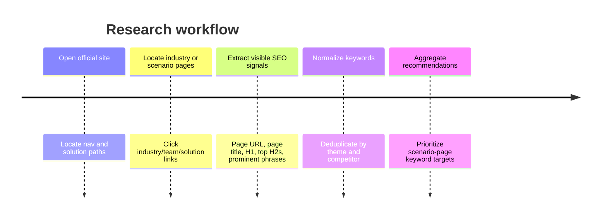

# Industry and Scenario SEO Keyword Extraction Report

## Executive summary

This crawl reviewed the official sites of the five TOB data-analysis competitors in your shortlist — Julius AI, Hex, Databricks Genie, Powerdrill, and ThoughtSpot — and extracted scenario-page SEO signals only from accessible industry, vertical, solutions, and scenario pages. The most reusable keyword pattern was not generic “AI data analysis,” but a richer formula of **platform/category term + team or industry + concrete business outcome**. fileciteturn0file1 citeturn7view0turn18view1turn10view0

Among the five, **Hex** is strongest on **functional/team scenario pages** such as product, marketing, sales, and customer success; **Databricks** is strongest on **industry solution pages** built around its “Data Intelligence Platform” framing; and **ThoughtSpot** is strongest on **pain-led industry pages** with dense use-case keyword coverage. citeturn7view1turn31view0turn31view1turn18view1turn29view3turn29view4turn10view0turn10view1turn35view1

Across the accessible corpus, the highest-overlap themes were **analytics platform positioning**, **self-serve / natural-language access**, **governed and trustworthy answers**, and scenario terms tied to **churn, customer health, campaign analytics, revenue intelligence, fraud/compliance, and inventory / OTIF optimization**. Julius AI and Powerdrill did not expose discoverable official industry/scenario pages in the accessible crawl and are therefore marked **not found** for this scope. citeturn4view0turn4view3turn7view4turn18view1turn33view0

## Method and source handling

Crawl date for all accessed URLs: **2026-05-28** in **America/Los_Angeles**. I used **official sites only** and relied on visible page content plus accessible HTML/page-title output from the official pages. No third-party SEO tools were used. Where a page existed but the **meta description was not directly visible** in accessible HTML, I marked it **not found**. Where the page appeared heavily JS-rendered or inaccessible, I marked it **JS-rendered; meta not directly visible** or **not found**, per your instruction.



Representative page snippets, included because screenshot capture was not available for these HTML pages:

```text
Hex marketing page
# Grow pipeline with clarity
## Combine all your marketing data sources
## Forecast probable ROI
## Let marketing answer their questions on-demand
```

Captured from the official Hex marketing scenario page. citeturn31view0

```text
Databricks healthcare page
# Databricks for Healthcare and Life Sciences
## Your data, your patients, your breakthroughs
... query everything in plain English with Genie
```

Captured from the official Databricks healthcare industry page. citeturn30view1

```text
ThoughtSpot supply chain page
# Increase Supply Chain Agility And Resilience With Spotter
## Every Supply Chain Fire Started as a Missed Signal
## The Agentic Analytics Platform For Supply Chain
#### OTIF Performance Tracking
#### Inventory Optimization Intelligence
```

Captured from the official ThoughtSpot supply-chain industry page. citeturn33view0turn33view1

## Competitor findings

**Julius AI**  
Official domain: `https://julius.ai`

| Page URL | Meta Title | Meta Description | H1 | H2 (top 3) | Extracted keywords/phrases | Notes |
|---|---|---|---|---|---|---|
| `https://julius.ai/` | Julius AI: Excel, Slides, Tasks with AI | not found | not found | not found | not found | No official industry/vertical/solutions/scenario pages were discoverable in the accessible crawl. Homepage rendered only as an image entry, so this competitor is marked **not found** for this scope. Accessed 2026-05-28. citeturn4view0 |

Julius AI may have additional content behind client-side rendering or inaccessible navigation, but nothing verifiable within the requested scope surfaced in the accessible official crawl. citeturn4view0

**Hex**  
Official domain: `https://hex.tech`

| Page URL | Meta Title | Meta Description | H1 | H2 (top 3) | Extracted keywords/phrases | Notes |
|---|---|---|---|---|---|---|
| `https://hex.tech/solutions/data-leaders/` | Hex for Data Leaders: Scale Teams and Govern AI \| Hex | not found | Data leaders: Focus your team and scale answers | Inform strategy with actual root cause<br>Governed self-serve, with AI enhancement<br>Unify your data team’s workflow | data leaders; govern AI; governed self-serve; AI enhancement; semantic layer; trusted answers; query to storytelling | Accessed 2026-05-28; meta description not directly visible in accessible HTML. citeturn7view0 |
| `https://hex.tech/solutions/product-analytics/` | Hex for product analytics \| Hex | not found | Product moves faster when data is in the room | Learn the reasons behind churn and expansion<br>Know where to invest in your product next<br>Show your work as you go | product analytics; churn and expansion; product roadmap; user behavior; experiments; feature adoption; usage metrics; data-backed answers | Accessed 2026-05-28; meta description not directly visible in accessible HTML. citeturn7view1turn8view3 |
| `https://hex.tech/solutions/marketing/` | Marketing Analytics for Campaign and Attribution \| Hex | not found | Grow pipeline with clarity | Combine all your marketing data sources<br>Forecast probable ROI<br>Let marketing answer their questions on-demand | marketing analytics; campaign attribution; marketing data sources; probable ROI; cohort analysis; engagement scoring; predictive analysis; campaign performance; pipeline dashboard | Accessed 2026-05-28; meta description not directly visible in accessible HTML. citeturn7view2turn31view0 |
| `https://hex.tech/solutions/sales-analytics/` | Sales Analytics for Revenue and GTM Teams \| Hex | not found | Insights for sales. Sanity for your data team. | Map the fastest plan to your revenue target<br>Data views that keep your sales team two steps ahead<br>Flexible for sales; reliable data for everyone | sales analytics; revenue teams; GTM teams; pipeline clarity; automated forecasts; AI-driven natural language; sales stage conversion; funnel analysis; predictive lead scoring | Accessed 2026-05-28; meta description not directly visible in accessible HTML. citeturn7view3turn31view1 |
| `https://hex.tech/solutions/customer-success/` | Hex for customer success \| Hex | not found | All your customer success data in one place | Customer health, built from your relevant data sources<br>Proactive customer support<br>One hub for all customer questions | customer success; customer health; dynamic health scores; churn predictors; onboarding insights; product usage, billing, support, and CRM data; renewal risks; account 360 | Accessed 2026-05-28; meta description not directly visible in accessible HTML. citeturn7view4turn8view2 |

Hex’s SEO pattern is the clearest functional-scenario model in this set: it builds pages around **teams and workflows**, then layers in hard-working modifiers like **governed self-serve**, **predictive analysis**, **campaign attribution**, **pipeline health**, and **customer health**. citeturn7view0turn8view3turn31view0turn31view1turn8view2

**Databricks Genie**  
Official domain: `https://www.databricks.com`  
Note: the pages below are official Databricks industry/scenario pages surfaced from the Genie product navigation. Some are broader **Databricks industry solution pages**, not Genie-only pages.

| Page URL | Meta Title | Meta Description | H1 | H2 (top 3) | Extracted keywords/phrases | Notes |
|---|---|---|---|---|---|---|
| `https://www.databricks.com/solutions/industries/financial-services` | Data Intelligence for Financial Services \| Databricks | not found | The Data Intelligence Platform for Financial Services | Your data, your AI, your future<br>Drive growth<br>Protect the firm | data intelligence platform; financial services; hyperpersonalization and lead management; fraud prevention; risk management; regulatory compliance; treasury; channel optimization; office automation; Genie scales financial analytics | Accessed 2026-05-28; meta description not directly visible in accessible HTML. Page is solution-led and includes a Genie mention in-page. citeturn18view1turn34view0 |
| `https://www.databricks.com/solutions/industries/healthcare-and-life-sciences` | Healthcare and Life Sciences Solutions \| Databricks | not found | Databricks for Healthcare and Life Sciences | Your data, your patients, your breakthroughs<br>Increase R&D productivity<br>Accelerate drug discovery | healthcare and life sciences; AI, apps and agents; clinical, claims and research data; plain English with Genie; multimodal models; drug discovery; patients; breakthroughs; governed platform | Accessed 2026-05-28; meta description not directly visible in accessible HTML. Strongest Genie tie among Databricks industry pages in this crawl. citeturn29view3turn30view1 |
| `https://www.databricks.com/solutions/industries/retail-industry-solutions` | Retail and Consumer Goods \| Databricks | not found | The Data Intelligence Platform for Retail and Consumer Goods | Your data, your AI, your future<br>Personalize and monetize the customer experience<br>Build supply chain resiliency | retail and consumer goods; customer experience; customer insights management; hyperpersonalized experiences; retail media networks; employee 360; agentic workforce; supply chain risk management; demand and inventory optimization | Accessed 2026-05-28; meta description not directly visible in accessible HTML. citeturn29view4turn30view0 |
| `https://www.databricks.com/solutions/industries/manufacturing-industry-solutions` | Manufacturing Solutions \| Databricks | not found | The Data Intelligence Platform for Manufacturing | Your data, your AI, your future<br>Boost revenue growth<br>Improve industrial productivity | manufacturing; industrial AI; connected products; digital supply chain; engineering and R&D transformation; financial planning and analysis; cybersecurity; value chain | Accessed 2026-05-28; meta description not directly visible in accessible HTML. citeturn29view5turn30view4 |
| `https://www.databricks.com/solutions/industries/media-and-entertainment` | Media and Entertainment Solutions \| Databricks | not found | The Data Intelligence Platform for Media and Entertainment | Your data, your AI, your future<br>Know your audience<br>Grow and retain your audience | media and entertainment; identity and customer 360; personalization; retention; ad campaigns; marketing; customer experience; monetization; content supply chain; player-centric experience | Accessed 2026-05-28; meta description not directly visible in accessible HTML. citeturn29view6turn30view2 |
| `https://www.databricks.com/solutions/industries/marketing` | Data Intelligence for Marketing \| Databricks | not found | Data Intelligence for Marketing / Your martech tools are not letting you down, your data platform is. | What can you do with Data Intelligence for Marketing?<br>Data Management<br>Customer Insights | marketing; martech stack; customer and campaign data; self-serve insights; campaign planning; campaign measurement; campaign optimization; customer insights; propensity scoring; next best actions | Accessed 2026-05-28; page appears partly JS-rendered and exposes dual H1-style headings; meta description not directly visible. citeturn29view7turn30view3 |

Databricks leans hard into **industry SEO**, but its keyword framing is broader and more platform-led than Hex’s. The repeated template is **“Data Intelligence Platform for [industry]”** plus outcome clusters like **fraud prevention**, **regulatory compliance**, **customer 360**, **supply chain risk management**, and **self-serve insights**. citeturn18view1turn29view3turn29view4turn29view5turn29view6turn29view7

**Powerdrill**  
Official domain: `https://powerdrill.ai`

| Page URL | Meta Title | Meta Description | H1 | H2 (top 3) | Extracted keywords/phrases | Notes |
|---|---|---|---|---|---|---|
| `https://powerdrill.ai/` | Powerdrill Bloom - Your AI Agents Team | not found | not found | not found | not found | No official industry/vertical/solutions/scenario pages were discoverable in the accessible crawl. The homepage returned as essentially empty/JS-rendered in accessible parsing, so this competitor is marked **not found** for this scope. Accessed 2026-05-28. citeturn4view3 |

Powerdrill may have additional official content behind client-side rendering, but no verifiable industry/scenario pages were discoverable from the accessible official entry point during this crawl. citeturn4view3

**ThoughtSpot**  
Official domain: `https://www.thoughtspot.com`

| Page URL | Meta Title | Meta Description | H1 | H2 (top 3) | Extracted keywords/phrases | Notes |
|---|---|---|---|---|---|---|
| `https://www.thoughtspot.com/solutions/financial-analytics` | Spotter: Agentic Analytics for Financial Services | not found | From Signals To Defensible Decisions With Spotter | In Finance, Missing the Full Picture Costs You Clients, Margin, and Control<br>The Agentic Analytics Platform For Financial Services<br>Your Analytics Agent For Financial Services | financial services; signals to defensible decisions; client, transaction, and risk data; credit and concentration risk; trading and position intelligence; fraud and compliance analytics; portfolio and advisory intelligence; claims leakage detection; regulatory readiness and efficiency; client relationship intelligence | Accessed 2026-05-28; meta description not directly visible in accessible HTML. citeturn10view0turn12view0turn13view2turn13view4 |
| `https://www.thoughtspot.com/solutions/retail-cpg-analytics` | Spotter: Agentic Analytics for Retail and Consumer Goods | not found | In Retail & CPG, Slow Decisions Cost You Revenue And Margins | In Retail & CPG, Slow Decisions Cost You Revenue and Margins<br>The Agentic Analytics Platform For Retail<br>Your Analytics Agent For Retail | retail and consumer goods; inventory to e-commerce; supply chain optimization; shrink and loss; operational expense control; promotion and markdown; conversion analysis; inventory coverage monitoring; sell-through intelligence; customer engagement optimization; answers at the speed of retail | Accessed 2026-05-28; meta description not directly visible in accessible HTML. citeturn10view1turn12view4turn32view0turn14view0 |
| `https://www.thoughtspot.com/solutions/healthcare-life-sciences-analytics` | Spotter: Agentic Analytics for Healthcare and Life Sciences | not found | From Clinical Signals To Commercial and Patient Impact With Spotter | Wrong Answers in Healthcare Costs Time, Money, and Lives<br>The Agentic Analytics Platform For Healthcare And Life Sciences<br>An Analyst At Your Fingertips, Trained For Healthcare And Life Sciences | healthcare and life sciences; clinical signals; trial, safety, and claims data; clinical trial acceleration; RWE and safety signal monitoring; claims and reimbursement optimization; commercialization and market access; supply chain resilience; provider network performance; risk adjustment and revenue integrity | Accessed 2026-05-28; meta description not directly visible in accessible HTML. citeturn10view2turn35view0turn14view1 |
| `https://www.thoughtspot.com/solutions/tech-software-analytics` | Spotter: Agentic Analytics for Software and Tech | not found | Turn Product Signals Into Revenue With Spotter | Slow Signals Cost You Retention and Revenue<br>The Agentic Analytics Platform For Technology & Software<br>An Analyst At Your Fingertips, Trained For Product Growth | technology and software; product signals; product, customer, and revenue data; expansion opportunity identification; net revenue retention monitoring; in-product agentic analytics; early warning churn signals; usage-based monetization analytics; experimentation and cohort analysis; white-label intelligence | Accessed 2026-05-28; meta description not directly visible in accessible HTML. citeturn10view3turn35view1turn14view2 |
| `https://www.thoughtspot.com/solutions/supply-chain-analytics` | Spotter: Agentic Analytics for Supply Chain | not found | Increase Supply Chain Agility And Resilience With Spotter | Every Supply Chain Fire Started as a Missed Signal<br>The Agentic Analytics Platform For Supply Chain<br>An Analyst At Your Fingertips, Trained For Supply Chain | supply chain; OTIF risks; inventory gaps; supplier delays; OTIF performance tracking; inventory optimization intelligence; supplier performance management; exception management acceleration; freight cost analysis; demand signal intelligence; perfect order rate optimization; transportation network optimization | Accessed 2026-05-28; meta description not directly visible in accessible HTML. citeturn10view4turn33view0turn33view1 |
| `https://www.thoughtspot.com/solutions/media-telecom-analytics` | Spotter: Agentic Analytics for Media & Telecoms | not found | Grow Subscribers And Spend Smarter With Spotter | Media & Telecoms Can't Afford to Be Behind the Curve<br>The Agentic Analytics Platform For Media & Telecoms<br>An Analyst At Your Fingertips, Trained For Media & Telecoms | media and telecoms; subscribers; churn prevention; network optimization; revenue protection; churn driver isolation; revenue leakage detection; quality of experience monitoring; campaign lift analysis; contact rate intelligence; engagement and retention metrics; outage impact assessment; ARPU and lifetime value tracking | Accessed 2026-05-28; meta description not directly visible in accessible HTML. citeturn10view5turn12view8turn32view4turn14view4 |

ThoughtSpot’s industry pages are the densest scenario-keyword assets in this crawl. Its pattern combines a **pain-led H1**, a repeated **“Agentic Analytics Platform for [industry]”** construct, and a long tail of **operational use-case phrases** such as **OTIF performance tracking**, **claims leakage detection**, **RWE & safety signal monitoring**, **net revenue retention monitoring**, and **ARPU and lifetime value tracking**. citeturn10view0turn32view0turn35view0turn35view1turn33view0turn32view4

## Consolidated deduplicated keyword inventory

The counts below are **competitor-level frequencies**, not page-level frequencies. They are synthesized from the official pages summarized above; Julius AI and Powerdrill contributed no discoverable industry/scenario pages in this crawl. citeturn4view0turn4view3turn7view0turn18view1turn10view0

| Theme | Normalized keyword or phrase | Competitors | Count | Representative wording seen on official pages |
|---|---|---|---:|---|
| Platform | analytics platform positioning | Hex, Databricks, ThoughtSpot | 3 | AI Analytics Platform; Data Intelligence Platform; Agentic Analytics Platform |
| Platform | self-serve analytics / self-serve insights | Hex, Databricks, ThoughtSpot | 3 | governed self-serve; self-serve insights; answer questions on-demand |
| Platform | governed / trusted / explainable answers | Hex, Databricks, ThoughtSpot | 3 | governed self-serve; governed platform; traceable, verifiable answers |
| Platform | natural language / plain English analytics | Hex, Databricks, ThoughtSpot | 3 | AI-driven natural language; query everything in plain English with Genie; ask questions in plain language |
| Functional | marketing analytics / campaign analytics | Hex, Databricks, ThoughtSpot | 3 | campaign attribution; campaign measurement; campaign lift analysis |
| Functional | customer success / churn / account health | Hex, Databricks, ThoughtSpot | 3 | customer health; churn predictors; early warning churn signals |
| Functional | product analytics / experimentation / cohorts | Hex, Databricks, ThoughtSpot | 3 | product analytics; experimentation and cohort analysis; usage metrics |
| Functional | revenue intelligence / growth / monetization | Hex, Databricks, ThoughtSpot | 3 | revenue and GTM; monetization analytics; growth opportunities |
| Industry | financial services analytics | Databricks, ThoughtSpot | 2 | financial services; fraud prevention; risk management; client and transaction data |
| Industry | healthcare and life sciences analytics | Databricks, ThoughtSpot | 2 | patients and breakthroughs; clinical trial acceleration; claims and reimbursement |
| Industry | retail / consumer goods / CPG analytics | Databricks, ThoughtSpot | 2 | retail and consumer goods; inventory to e-commerce; sell-through intelligence |
| Industry | media / telecom / entertainment analytics | Databricks, ThoughtSpot | 2 | media and entertainment; media & telecoms; ARPU and lifetime value |
| Industry | supply chain / inventory / OTIF analytics | Databricks, ThoughtSpot | 2 | supply chain risk management; OTIF performance tracking; inventory optimization |
| Operational risk | fraud prevention / fraud analytics | Databricks, ThoughtSpot | 2 | fraud prevention; fraud and compliance analytics |
| Operational risk | risk management / regulatory compliance | Databricks, ThoughtSpot | 2 | risk management; regulatory compliance; regulatory readiness |
| Customer data | customer 360 / customer insights / personalization | Databricks, ThoughtSpot | 2 | customer 360; customer insights management; personalized experiences |
| Functional | sales analytics / pipeline / forecasting | Hex | 1 | sales analytics; pipeline clarity; automated forecasts |
| Functional | data leaders / governed self-serve | Hex | 1 | data leaders; govern AI; semantic layer |
| Industry | manufacturing / industrial AI | Databricks | 1 | industrial AI; connected products; digital supply chain |
| Delivery model | embedded / in-product / white-label analytics | ThoughtSpot | 1 | in-product agentic analytics; white-label intelligence |

The strongest reusable pattern for your own scenario-page strategy is therefore: **“AI Data Analyst / Agentic Analytics / Data Intelligence” + “for [industry or team]” + “for [high-value outcome]”**. That is the shared structure behind the highest-signal competitor pages in this crawl. citeturn31view0turn18view1turn35view1

## Recommended scenario-page keywords

Prioritization below favors phrases that combine **clear buying intent**, **strong cross-competitor overlap**, and **room for differentiation** if your positioning is “enterprise AI data analyst” rather than just “BI” or “dashboarding.”

| Priority | Suggested keyword or phrase | Why it should be a page |
|---|---|---|
| Highest | **Enterprise AI Data Analyst for Financial Services** | Strong overlap from Databricks and ThoughtSpot; high buyer value; natural bridge to fraud, risk, compliance, and client analytics |
| Highest | **Enterprise AI Data Analyst for Healthcare and Life Sciences** | Strong cross-competitor signal and high-intent vertical language around clinical, claims, safety, and commercialization |
| Highest | **Enterprise AI Data Analyst for Retail and Consumer Goods** | Clear overlap on retail, CPG, customer experience, inventory, and margin use cases |
| Highest | **AI Product Analytics for SaaS and Software Teams** | Hex and ThoughtSpot both lean into product, expansion, retention, and cohort analysis language |
| Highest | **AI Marketing Analytics for Campaign Measurement and Attribution** | Hex and Databricks are both strong here; highly actionable scenario-page keyword set |
| Highest | **AI Customer Success Analytics for Churn Prediction and Account Health** | Strong intent, strong overlap, and highly aligned with “AI analyst” positioning |
| High | **AI Supply Chain Analytics for Inventory, OTIF, and Demand Signals** | ThoughtSpot is especially explicit here, and Databricks reinforces the broader supply-chain vocabulary |
| High | **AI Sales Analytics for Pipeline Health and Forecasting** | Hex owns this angle clearly; still attractive if your product can claim deeper multi-source analysis |
| High | **AI Fraud, Risk, and Compliance Analytics** | High-value operational-intent cluster that appears repeatedly in Databricks and ThoughtSpot |
| High | **AI Data Analyst for Media and Telecom Subscriber Analytics** | Useful if you want a subscriber-growth / churn / ARPU vertical wedge rather than only broad “telecom analytics” |
| Medium | **AI Customer 360 and Personalization Analytics** | Strong supporting cluster from Databricks and adjacent to product/marketing/customer-success pages |
| Medium | **Agentic Analytics for Manufacturing Operations and Industrial AI** | Good differentiation page if you want an operations-heavy vertical entry rather than generic manufacturing analytics |

If you want the most practical immediate rollout, the first page batch I would build is: **financial services**, **healthcare & life sciences**, **retail & CPG**, **product analytics**, **marketing analytics**, **customer success analytics**, and **supply chain analytics**. Those seven topics sit closest to the highest-density competitor keyword territory exposed in this crawl. citeturn18view1turn29view3turn29view4turn8view3turn31view0turn8view2turn33view0